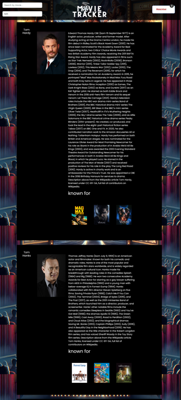
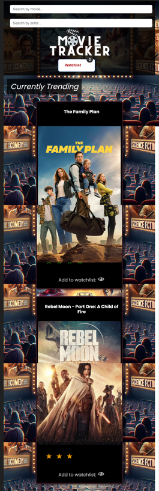
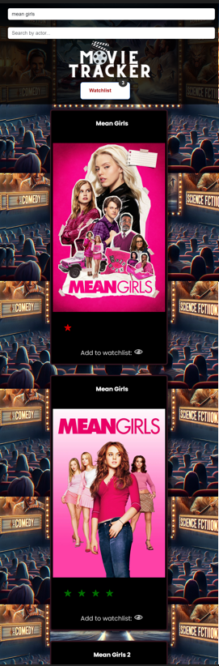
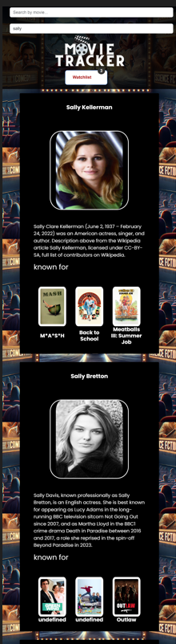

# NicodingProject1
Group 6 - Nicoding - Project 1

## Table of Contents

- [Description](#description)
- [Motivation](#motivation)
- [User Story](#userstory)
- [Learning Journey](#learning)
- [Usage](#usage)
- [Features](#features)
- [Testing](#testing)
- [Future Development](#future)
- [Resources](#resoures)
- [Links](#links)
- [Credits](#credits)
- [License](#license)

## Description
Movie Tracker is a comprehensive and user-friendly movie searching website that caters to both casual moviegoers and avid cinephiles.

***Key Features:***
* Movie Search: search for movies by title,modal popup when movie poster is clicked, trailer embedded in modal
* Actor Search: actor's profile: a short overview, theirpicture and 3 highest rated movies
* Watchlist Feature: users to create and manage a personalized watchlist
* User-Friendly Interface: clean and intuitive design,responsive search bar and easy to find watchlist button

## Motivation 
The motivation for our project was a combination of passion and real-world problem. 

* Passion: We love watching movies.
* ​Problem: We struggled to organise our movie watching. 
* We wanted to create an app that would make movie nights easy peasy and answer the age-old question "What have I seen that actor in before?"

We created this app so that movie lovers could check out which films are trending at the moment, search for movies by title, add movies to a watchlist, see how many stars it has, read the movie summary, watch the trailer, check out who the main actors are, and find out information about actors.​

- Why did you build this project? (Note: the answer is not "Because it was a homework assignment.")
- What problem does it solve?

## User Story 
#We used the following User Story to define the goals and requirements of this project: 

* AS A movie fanatic​

* I WANT to be able to see which films are trending right now, search for movies by title, watch the trailer, see how many stars it has, read the movie summary, check out who the main actors are, find out information about actors, and add movies to a watchlist.​

* SO THAT I can organize my movie watching

## Learning Journey

This project gave us the opportunity to learn about collaborating on code, how to utilise server-side API'S, how to implement modals and improved our HTML, CSS and JavaScript Skills. 


## Usage

# User Walkthrough Video

[moviewebsite.webm](https://github.com/KyloGG88/NicodingProject1/assets/147415364/d7d0277b-4244-49c5-8295-1b3c6da67323)

Add more here and explain modals 


homepage


movie search



actor search

!alt text[](assets/images/wishlist.png)

mobile responisvenesss








Provide instructions and examples for use. Include screenshots as needed.

To add a screenshot, create an `assets/images` folder in your repository and upload your screenshot to it. Then, using the relative filepath, add it to your README using the following syntax:

    ```md
    
    ```


## Features

***Our Website Features***

* Mobile Responsive.
* Clean and Polished UI.
* Intuitive and Easy to Navigate UX.
* A Header/Navigation Bar with Search Bar for Movies, Search Bar for Actors, Logo and Watchlist Button.
* Logo returns user to hompage.
* Homepage features movies that are trending right now.
* Cards on the homepage feature movie title, image, color-coded star rating and add to watchlist button.
* When users click on the movie image they will see a modal showing movie overview, main actors and a trailer video.
* Users can press the x to exit out of the modal.
* Users can view movies they've added to the watchlist by clicking the watchlist button on the right hand side of the header/navigation bar.
* Watchlist Movies are saved to local storage and movie cards in the watchlist feature the movie title, image, star rating and overview. 
* The Movie Searchbar allows users to search for movies by entering a word(s). The returned movie cards have the same features as the homepage cards.
* The Actor Searchbar allows users to search for actors by entering their name.
* The returned actors cards feature actor name, actor headshot image, actor infomration and biography, and images of movies they're known for. 

## Testing

We manually tested this app, ensuring that: 
*search results were correct for movie search bar 
*search results were correct for actor search bar 
*films were being added to and removed from watchlist 
*modals were working correctly for movie cards 
*mobile responsivess was working correctly

## Future Development

* Integrate"genre" category into search feature
* Merge search bar for Movie Title and Actor into one
* Be able to categorise movies within the watchlist (date night, Christmas time etc)
* Add a remove from watchlist button in the watchlist cards
* Machine learning – Use predictive modellingto predict movies that the user would like

## Resources

***Bootstrap 4***
*     https://getbootstrap.com/docs/4.3/getting-started/introduction/
*     https://getbootstrap.com/docs/4.3/components/modal/
***TMDB API***
*     https://developer.themoviedb.org/docs/getting-started
***YouTube API***
*     https://developers.google.com/youtube/v3
***Javascript***
*     https://developer.mozilla.org/en-US/docs/Web/javascript
***jQuery***
*     https://api.jquery.com/jQuery.get/
***CSS***
*     https://web.dev/learn/css/
*     https://developer.mozilla.org/en-US/docs/Web/CSS/box-shadow
*     https://www.joshwcomeau.com/css/interactive-guide-to-flexbox/
*     https://css-tricks.com/snippets/css/a-guide-to-flexbox/
*     https://cdn.jsdelivr.net/npm/bootstrap@5.3.0-alpha3/dist/css/bootstrap.min.css

## Links

Nicoding Presentation: 

GitHub link: [Nicoding](https://github.com/KyloGG88/NicodingProject1)

GitPages link: [Nicoding](https://kylogg88.github.io/NicodingProject1/)

## Credits

* Jess [Github Profile](https://github.com/jessi994)
* Sarah [Github Profile](https://github.com/shemlock)
* Kyle [Github Profile](https://github.com/KyloGG88)

* We'd also like to thank TA's Nirav and Tikto for their help and guidance with this project. 

## License

Public - MIT License
