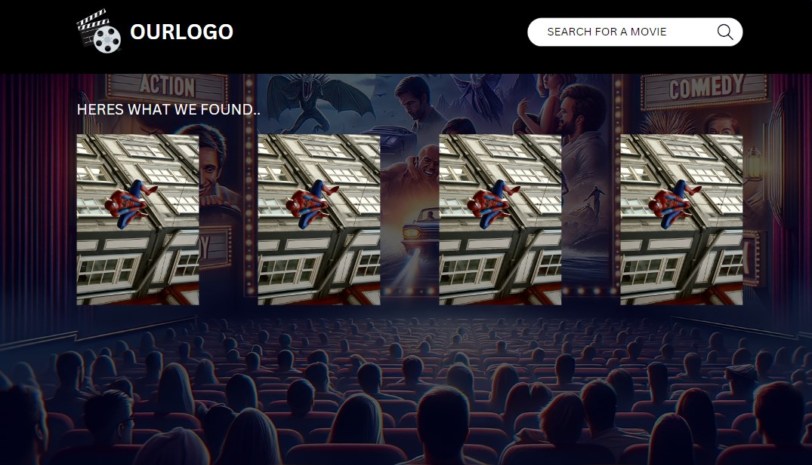

# NicodingProject1
Group 6 - Nicoding - Project 1
The link to the deployed application is here: https://kylogg88.github.io/NicodingProject1/

## Description

 ADD A DIFFERENT IMAGE

MovieTracker is an app that allows users to organise their movie watching.  ADD MORE TO THIS? 

MOTIVATION: 
The motivation for our project was a combination of passion and real-world problem. 

Passion: We love watching movies.

​Problem: We struggled to organise our movie watching. 

We wanted to create an app that would make movie nights easy peasy and answer the age-old question "What have I seen that actor in before?"

We created this app so that movie lovers could check out which films are trending at the moment, search for movies by title, add movies to a watchlist, see how many stars it has, read the movie summary, watch the trailer, check out who the main actors are, and find out information about actors.​

- Why did you build this project? (Note: the answer is not "Because it was a homework assignment.")
- What problem does it solve?

## User Story 
We used the following User Story to define the goals and requirements of this project: 

AS A movie fanatic​

I WANT to be able to see which films are trending right now, search for movies by title, watch the trailer, see how many stars it has, read the movie summary, check out who the main actors are, find out information about actors, and add movies to a watchlist.​

SO THAT I can organize my movie watching

## Learning Journey

This project gave us the opportunity to learn about collaborating on code, how to utilise server-side API'S, how to implement modals and improved our HTML, CSS and JavaScript Skills. 

## Table of Contents

- [Usage](#usage)
- [Credits](#credits)
- [Resources](#resoures)
- [License](#license)

## Installation
N/A

## Usage

# User Walkthrough Video

[video.webm](https://github.com/KyloGG88/NicodingProject1/assets/147415364/ac755512-3223-4fff-a2e2-5eb33065283a)


Provide instructions and examples for use. Include screenshots as needed.

To add a screenshot, create an `assets/images` folder in your repository and upload your screenshot to it. Then, using the relative filepath, add it to your README using the following syntax:

    ```md
    
    ```


## Credits

Kyle, Jess and Sarah 

MAYBE MENTION TIKTO AND NIRAV? 

ADD API'S 

List your collaborators, if any, with links to their GitHub profiles.

If you used any third-party assets that require attribution, list the creators with links to their primary web presence in this section.

If you followed tutorials, include links to those here as well.

🏆 The previous sections are the bare minimum, and your project will ultimately determine the content of this document. You might also want to consider adding the following sections.

## Features

***Our Website Features***

* Mobile Responsive.
* Clean and Polished UI.
* Intuitive and Easy to Navigate UX.
* A Header/Navigation Bar with Search Bar for Movies, Search Bar for Actors, Logo and Watchlist Button.
* Logo returns user to hompage.
* Homepage features movies that are trending right now.
* Cards on the homepage feature movie title, image, color-coded star rating and add to watchlist button.
* When users click on the movie image they will see a modal showing movie overview, main actors and a trailer video.
* Users can press the x to exit out of the modal.
* Users can view movies they've added to the watchlist by clicking the watchlist button on the right hand side of the header/navigation bar.
* Watchlist Movies are saved to local storage and movie cards in the watchlist feature the movie title, image, star rating and overview. 
* The Movie Searchbar allows users to search for movies by entering a word(s). The returned movie cards have the same features as the homepage cards.
* The Actor Searchbar allows users to search for actors by entering their name.
* The returned actors cards feature actor name, actor headshot image, actor infomration and biography, and images of movies they're known for. 


## Tests

We just tested manually really , not sure if that counts. 

## Resources

***Bootstrap 4***
*     https://getbootstrap.com/docs/4.3/getting-started/introduction/
*     https://getbootstrap.com/docs/4.3/components/modal/
***TMDB API***
*     https://developer.themoviedb.org/docs/getting-started
***YouTube API***
*     https://developers.google.com/youtube/v3
***Javascript***
*     https://developer.mozilla.org/en-US/docs/Web/javascript
***jQuery***
*     https://api.jquery.com/jQuery.get/
***CSS***
*     https://web.dev/learn/css/
*     https://developer.mozilla.org/en-US/docs/Web/CSS/box-shadow
*     https://www.joshwcomeau.com/css/interactive-guide-to-flexbox/
*     https://css-tricks.com/snippets/css/a-guide-to-flexbox/
*     https://cdn.jsdelivr.net/npm/bootstrap@5.3.0-alpha3/dist/css/bootstrap.min.css

## License

Public - MIT License
